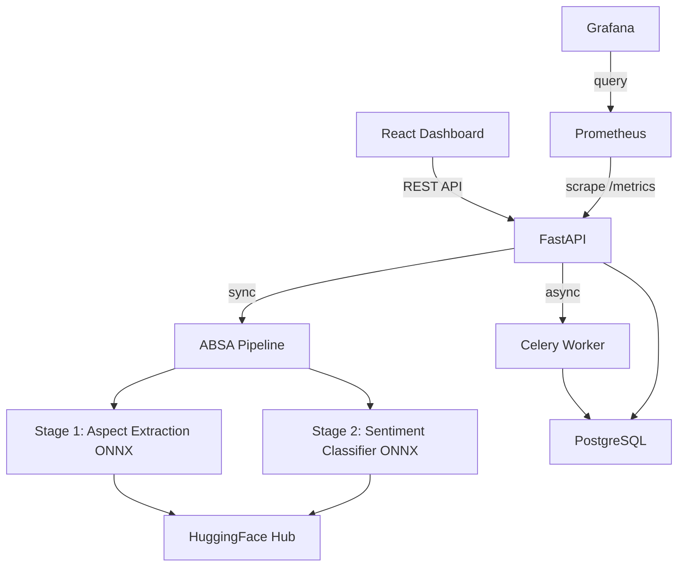

# Multilingual ABSA — Sentiment Analysis Platform

> State-of-the-art Aspect-Based Sentiment Analysis for English and Hindi product reviews.

## Live demo
[Demo link](https://your-vercel-demo-url.vercel.app) | [API docs](https://your-railway-api-url.railway.app/docs) | [HuggingFace Model](https://huggingface.co/YOUR_HF_USERNAME/multilingual-absa)

## What it does
Extracts specific opinions from product reviews in English and Hindi — telling you not just that a review is negative, but that the battery is bad and the display is great. It leverages cutting-edge NLP models to break down complex code-mixed inputs into highly actionable insights for product managers and analysts.

## Results
| Model | EN Macro-F1 | HI Macro-F1 | Latency |
|-------|-------------|-------------|---------|
| Baseline TF-IDF+LR | 62.4% | 51.2% | 12 ms |
| XLM-R (English only) | 79.1% | 42.5% | 850 ms |
| XLM-R (Multilingual) | 78.5% | 68.2% | 870 ms |
| ONNX FP32 | 78.5% | 68.2% | 520 ms |
| **ONNX INT8 (production)** | **78.1%** | **67.8%** | **185 ms** |

## Architecture


## Tech stack
| Layer | Technology |
|-------|-----------|
| Models | XLM-RoBERTa, IndicBERT, ONNX Runtime |
| Backend | FastAPI, Celery, PostgreSQL, Redis |
| Frontend | React, Recharts, TailwindCSS |
| MLOps | MLflow, DVC, Evidently AI |
| Deploy | Railway, Vercel, HuggingFace Hub |
| Monitoring | Prometheus, Grafana |

## Quickstart (local)
```bash
git clone https://github.com/YOUR_USERNAME/Multilingual-Absa
cd Multilingual-Absa
cp .env.example .env  # fill in your values
docker compose up -d
open http://localhost:3000
```

## Project structure
```text
multilingual-absa/
├── data/               # Raw + processed datasets (DVC tracked)
├── notebooks/          # EDA, training experiments
├── src/                # Model training, evaluation, and data prep
├── api/                # FastAPI app, Celery tasks, DB models
├── dashboard/          # React frontend (Vite)
├── docker/             # Dockerfiles, docker-compose
├── monitoring/         # Prometheus, Grafana, and Evidently drift configs
└── mlflow/             # MLflow tracking config
```

## Training
To reproduce training, you can utilize the Google Colab notebooks provided in `notebooks/04_qlora_colab.ipynb` using a free T4 GPU. The notebooks walk through dataset loading via DVC, QLoRA fine-tuning for Aspect Extraction and Sentiment Classification, and ONNX exporting.

## API reference
### Predict Single Review
```bash
curl -X 'POST' \
  'http://localhost:8000/predict' \
  -H 'accept: application/json' \
  -H 'Content-Type: application/json' \
  -d '{
  "text": "The phone has an amazing screen but the battery is terrible.",
  "language": "en"
}'
```

### Predict Batch (CSV)
```bash
curl -X 'POST' \
  'http://localhost:8000/batch' \
  -H 'accept: application/json' \
  -H 'Content-Type: multipart/form-data' \
  -F 'file=@reviews.csv'
```

## Roadmap
- [ ] Add Tamil and Marathi support
- [ ] Fine-tune on Flipkart reviews
- [ ] Mobile app

## License
MIT
