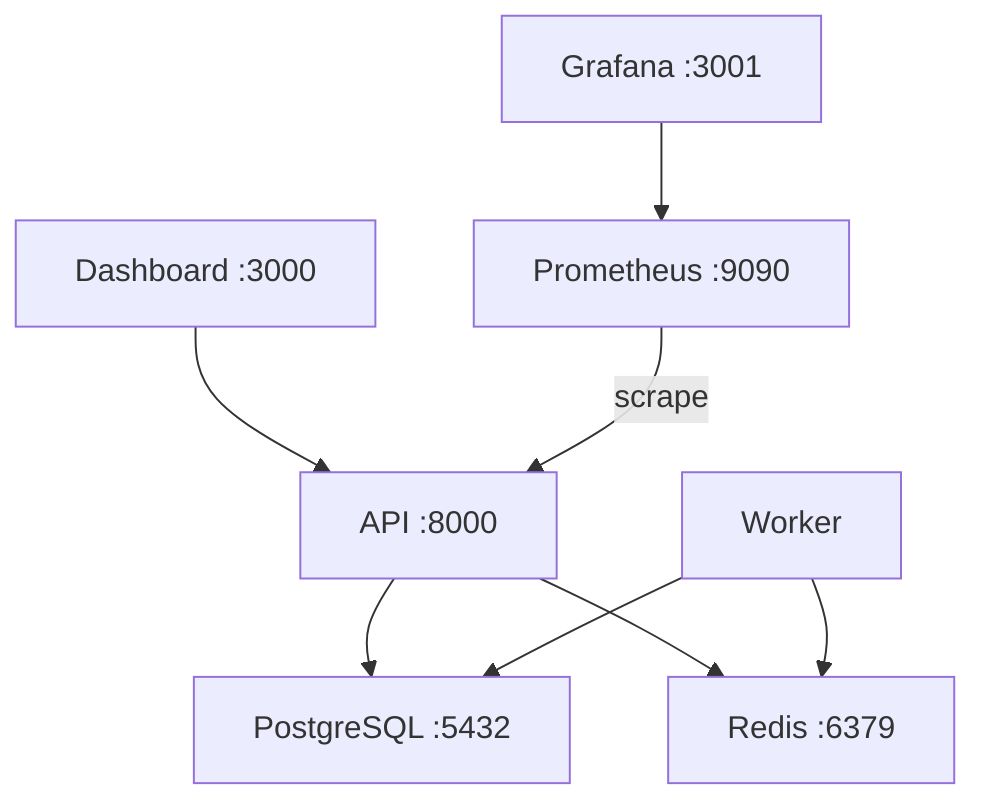
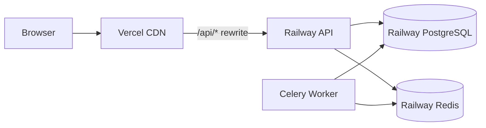

# Deployment Guide — Multilingual ABSA

## Prerequisites

- Python 3.11+
- 
- Docker & Docker Compose (for containerized deployment)
- Railway account (for API deployment)
- 

## Environment Variables

| Variable | Dev Default | Production | Required By |
|----------|-------------|------------|-------------|
| `DATABASE_URL` | `sqlite:///absa.db` | PostgreSQL URL | API + Worker |
| `REDIS_URL` | `redis://localhost:6379/0` | Redis URL | API + Worker |
| `MODEL_PATH` | `models/onnx/` | (same or HF Hub) | API |
| `MAX_BATCH_SIZE` | `10000` | `10000` | API |
| `LOG_LEVEL` | `INFO` | `WARNING` | API |
| `ENABLE_METRICS` | `true` | `true` | API |
| `HF_MODEL_REPO` | (empty) | `username/multilingual-absa` | API |
| `MODEL_SOURCE` | `local` | `huggingface_hub` | API |

## Local Development

```bash
# Backend
cp .env.example .env
python -m venv .venv && source .venv/bin/activate
pip install -r requirements.txt
uvicorn api.main:app --reload --host 0.0.0.0 --port 8000
# API at http://localhost:8000, docs at http://localhost:8000/docs

# MLflow
./scripts/mlflow_ui.sh
# MLflow UI at http://localhost:5000

# Frontend
```

## Docker Compose (Full Stack)

```bash
docker-compose -f config/docker/docker-compose.yml up --build
```

Services started:

| Service | Container Name | Port | Dependencies |
|---------|---------------|------|--------------|
| `api` | `absa-api` | 8000 | postgres, redis |
| `worker` | `absa-worker` | — | postgres, redis, api |
| `dashboard` | `absa-dashboard` | 3000 (=> 80) | api |
| `postgres` | `absa-postgres` | 5432 | — |
| `redis` | `absa-redis` | 6379 | — |
| `prometheus` | — | 9090 | api |
| `grafana` | — | 3001 | prometheus |



## Production Deployment (Railway + Vercel)

### Railway (API + Worker)

1. Create a Railway project from your Git repository
2. Set build command: uses `railway.json` → `Dockerfile.api.prod`
3. Set environment variables in Railway dashboard:
   - `DATABASE_URL` → Railway PostgreSQL plugin connection string
   - `REDIS_URL` → Railway Redis plugin connection string
   - `MODEL_SOURCE=huggingface_hub`
   - `HF_MODEL_REPO=your-username/multilingual-absa`
   - `ENABLE_METRICS=true`
   - `LOG_LEVEL=WARNING`
4. Add a second service for the Celery worker with command:
   `celery -A api.tasks.batch_tasks worker --loglevel=warning`

### Vercel (Dashboard)

2. Framework preset: Vite
3. Environment variable: `VITE_API_URL=https://your-railway-api-url.railway.app`
4. `vercel.json` rewrites `/api/*` to Railway API



## DVC Data/Model Sync

```bash
# Pull data/models from remote
dvc pull

# Run full ML pipeline
dvc repro

# Push new artifacts
dvc push
```

## Monitoring

| Tool | URL | Purpose |
|------|-----|---------|
| MLflow UI | `http://localhost:5000` | Experiment tracking |
| API Docs | `http://localhost:8000/docs` | Interactive API |
| Prometheus | `http://localhost:9090` | Metrics store |
| Grafana | `http://localhost:3001` | Visual dashboards |
| Dashboard | `http://localhost:5173` | User interface |

## Scaling

- **API**: Increase `--workers` in uvicorn command (2 in prod Dockerfile)
- **Worker**: Scale Celery worker containers horizontally
- **Database**: Use Railway managed PostgreSQL with auto-scaling
- **Memory limit**: 2GB per API container (configured in `docker-compose.prod.yml`)
