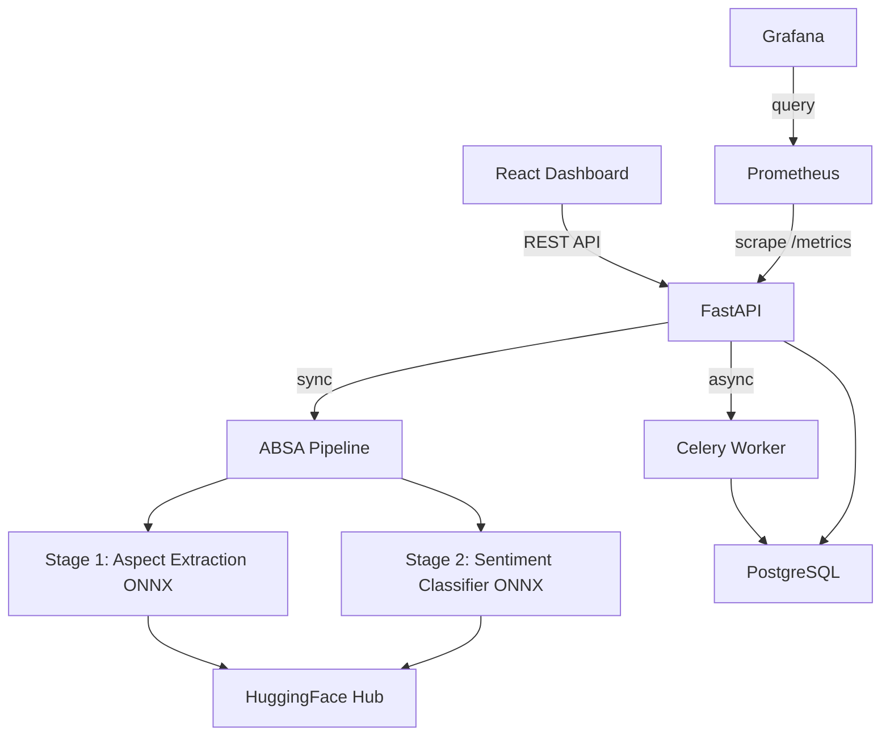
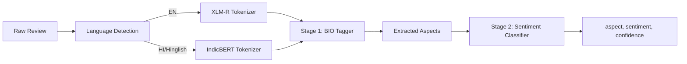

# Architecture Diagrams

## 1. System Architecture

```mermaid
graph TD
  A[React Dashboard] -->|REST API| B[FastAPI]
  B -->|sync| C[ABSA Pipeline]
  B -->|async| D[Celery Worker]
  C --> E[Stage 1: Aspect Extraction ONNX]
  C --> F[Stage 2: Sentiment Classifier ONNX]
  D --> G[PostgreSQL]
  B --> G
  H[Prometheus] -->|scrape /metrics| B
  I[Grafana] -->|query| H
  E --> J[HuggingFace Hub]
  F --> J
```

## 2. ABSA Inference Pipeline

```mermaid
graph LR
  A[Raw Review] --> B[Language Detection]
  B -->|EN| C[XLM-R Tokenizer]
  B -->|HI/Hinglish| D[IndicBERT Tokenizer]
  C --> E[Stage 1: BIO Tagger]
  D --> E
  E --> F[Extracted Aspects]
  F --> G[Stage 2: Sentiment Classifier]
  G --> H[aspect, sentiment, confidence]
```
