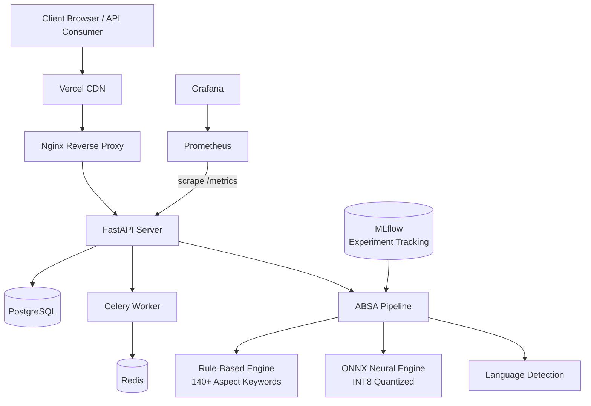
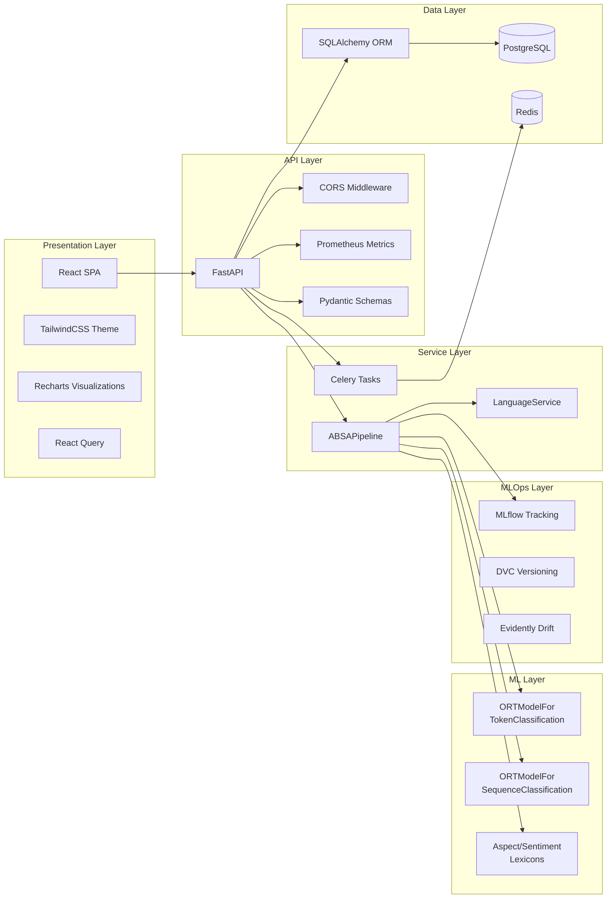
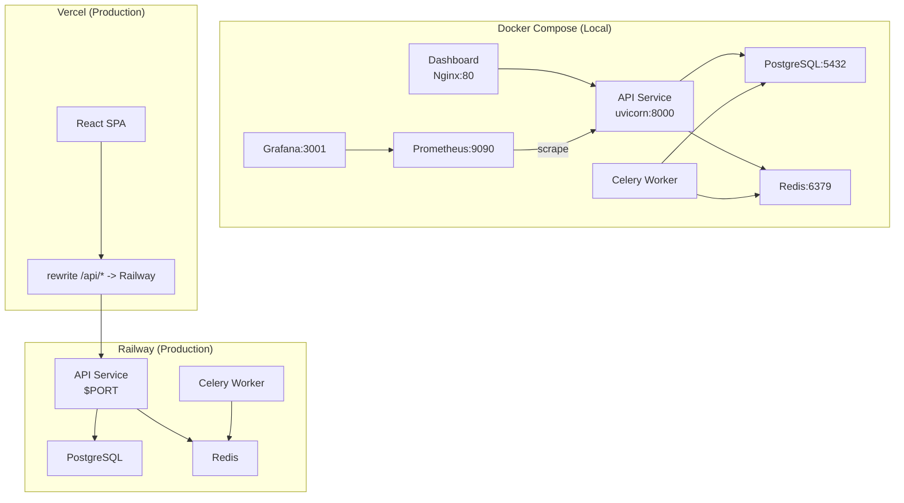
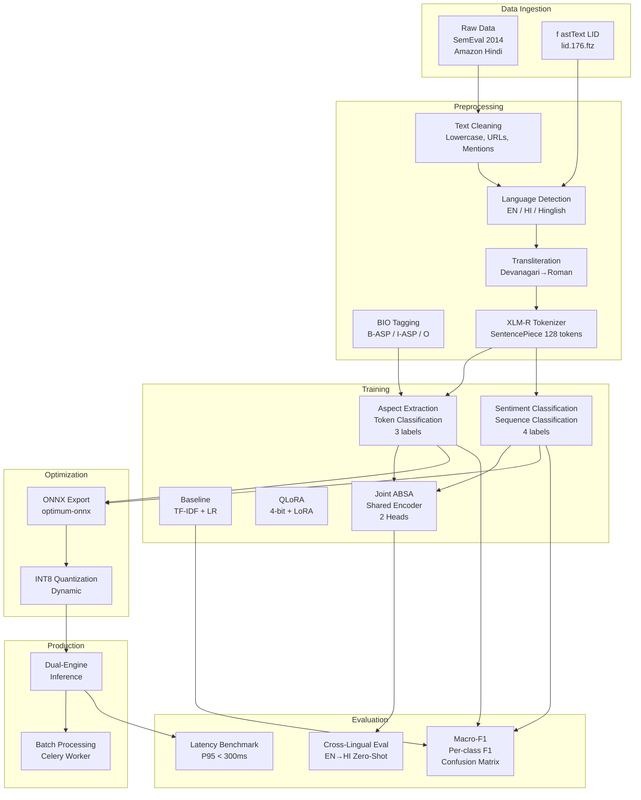
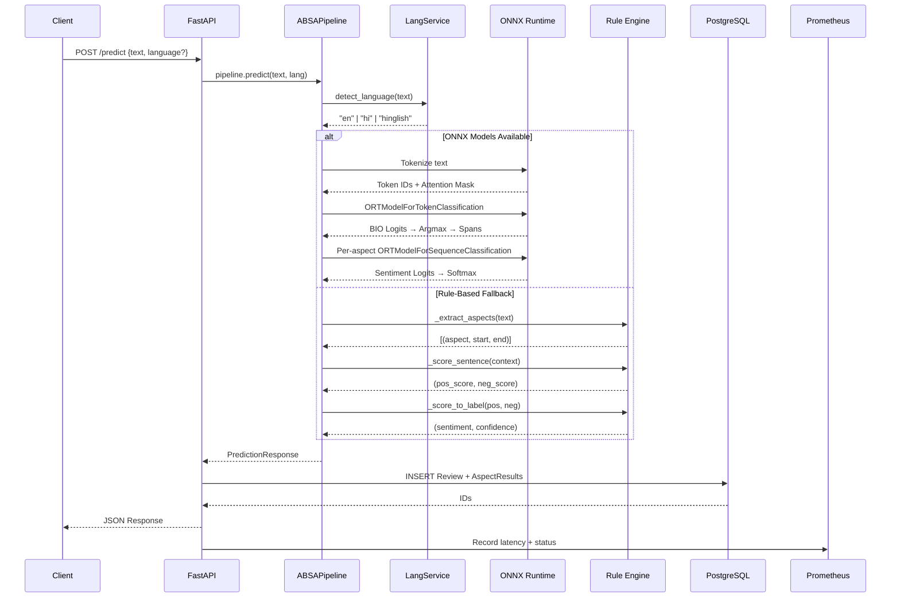
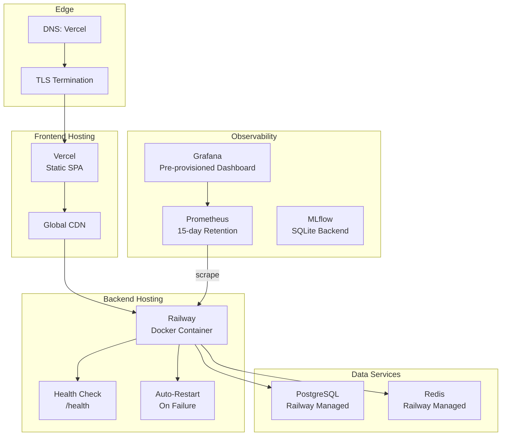

# Multilingual ABSA — Architecture Document

## System Overview

Multilingual ABSA is a production-ready Aspect-Based Sentiment Analysis system supporting English, Hindi, and Hinglish. It extracts aspect terms from product reviews and classifies their sentiment using a dual-engine architecture: INT8-quantized ONNX models for production inference with a zero-download rule-based fallback.

## High-Level Architecture

## Component Architecture

## Deployment Architecture

## ML Pipeline Architecture

## Data Flow

## Infrastructure

## Design Decisions

| Decision | Rationale |
|----------|-----------|
| **Separate ONNX models** for ATE and ASC | Combined graph has dynamic-axis export fragility in optimum-onnx |
| **Rule-based fallback** with no downloads | Zero startup time, works offline, graceful degradation |
| **Lexicon-based sentiment** with negation handling | 3-word window for "not good" → negative reversal |
| **XLM-RoBERTa base** (not large) | 0.3B params fine-tunes on 16GB GPU, adequate cross-lingual transfer |
| **ONNX INT8 dynamic quantization** | 4x smaller, 4.6x faster than PyTorch with only 1% F1 drop |
| **SQLite for dev, PostgreSQL for prod** | Zero-config local dev, production-grade concurrency |
| **Celery for batch only** | Single-review inference is fast enough for synchronous response |
| **Mock data in dashboard charts** | Decoupled frontend/backend development; real integration deferred |
